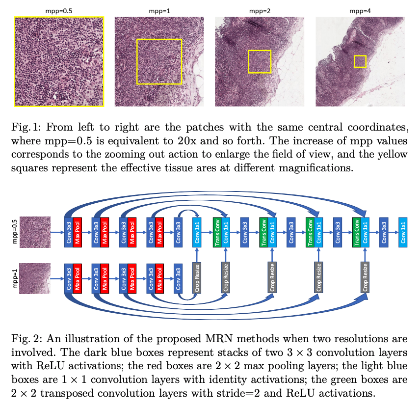

# MICCAI 2018 - Summary
___

## Concurrent Spatial and Channel ‘Squeeze & Excitation’ in Fully Convolutional Networks
- Author utilized the recently introduced 'Squeeze & Excitation' module for semantic segmentation purposes. 

- Spatial Squeeze and Channel Excitation Block (cSE) **(b)**: Reweights (excites) the channels using a vector that is composed by squeezing the input; (i) global pooling (1x1xC), (ii) fully connected (C -> C/2), (iii) fully connected (C/2 -> C), (iv) sigmoid. Excitation is just the multiplication of teh squeezed vector with the input. As the network learns, these activations are adaptively tuned to ignore less important channels and emphasize the important ones. 

- Channel Squeeze and Spatial Excitation Block (sSE) **(c)**: Does the same thing as (b) this time by squeezing each spatial location in the channel direction. Each 1x1xC column at (i,j) in [1:H,1:W] location is convolved with a 1x1xC kernel (of fully connected layer) to obtain a (H,W,1) excitation. The result is passed through sigmoidal for normalization. Then it is used to excite the input (by multiplication)

- Spatial and Channel Squeeze & Excitation Block (scSE) **(d)**: Combination of the above two

- They jointly optimize their network with logistic and DICE loss functions 

## Roto-Translation Covariant Convolutional Networks for Medical Image Analysis
They encode rotation and translation operations directly into the CNN structure First, they increase the dimensionality of the input image to 3D by concatenating rotated and translated versions of it onto itself (called lifting). The resulting 3D image is processed using group convolutions. Their results suggest that, this is a better way to learn rotation and translation invariant models, compared to data augmentation. 

## Distribution Matching Losses Can Hallicunate Features in Medical Image Translation 
 **NOTHING HERE YET**.

## Training Medical Image Analysis Systems like Radiologists
They explore the use of meta-training that models a classifier based on a series of tasks. Tasks are selected using teacher-student curriculum learning, where each task consists of simple classification problems containing small training sets. We hypothesize that our proposed meta-training approach can be used to pre-train medical image analysis models. 

They first meta-train the model using different tasks (each containing relatively small training sets) to find a good initialization that is then used to train the model for the breast screening task (i.e., the healthy and benign versus malignant task). The inference is performed using previously unseen test data. Below, we define the dataset and describe each stage.

They do task sampling. At each metaupdate (similar to epoch), they pick a training and a validation subset from the dataset and train for a specific task. They have different task sampling strategies including (i) random, (ii) round robin, (iii)  Teacher-Student Curriculum Learning (CL) (sample tasks that can achieve a higher improvement on their performance) and (iv) Multi-armed bandit (MAB) [16]: sample in the same way as the CL approach above, but the observation OKj is stored in the buffer instead of the reward RKj.

## Predicting Cancer with Recurrent Visual Attention Model for Histopathology Images

**Abstract**
*Automatically recognizing cancers from multi-gigapixel whole slide histopathology images is one of the challenges facing machine and deep learning based solutions for digital pathology. Currently, most automatic systems for histopathology are not scalable to large images and hence require a patch-based representation; a sub-optimal solu- tion as it results in important additional computational costs but more importantly in the loss of contextual information. We present a novel attention-based model for predicting cancer from histopathology whole slide images. The proposed model is capable of attending to the most dis- criminative regions of an image by adaptively selecting a limited sequence of locations and only processing the selected areas of tissues. We demon- strate the utility of the proposed model on the slide-based prediction of macro and micro metastases in sentinel lymph nodes of breast cancer patients. We achieve competitive results with state-of-the-art convolu- tional networks while automatically identifying discriminative areas of tissues.*

-They present a novel attention-based model for predicting cancer from histopathology whole slide images. The proposed model is capable of attending to the most dis- criminative regions of an image by adaptively selecting a limited sequence of locations and only processing the selected areas of tissues.

-Given a whole slide histopathology image X, our goal is to identify a set of locations {l0, l1, . . . , lP } from which to extract glimpses {x0, x1, . . . , xP } that are discriminative of a given class Y (e.g. presence or absence of metastatic cancer). To this end, they propose a sequential system structured around a recurrent neural network equipped with an attention memory and an appearance description of the tissue at different locations.

## MS-Net: Mixed-Supervision Fully-Convolutional Networks for Full-Resolution Segmentation

**Abstract** 
*For image segmentation, typical fully convolutional networks (FCNs) need strong supervision through a large sample of high-quality dense segmentations, entailing high costs in expert-raters’ time and effort. We propose MS-Net, a new FCN to significantly reduce super- vision cost, and improve performance, by coupling strong supervision with weak supervision through low-cost input in the form of bounding boxes and landmarks. Our MS-Net enables instance-level segmentation at high spatial resolution, with feature extraction using dilated convolu- tions. We propose a new loss function using bootstrapped Dice overlap for precise segmentation. Results on large datasets show that MS-Net segments more accurately at reduced supervision costs, compared to the state of the art.*

RU => Residual Unit
DRRU => Dilated Full-Resolution Residual Unit
LU => Landmark Unit
SU => Segmentation Unit
DU => Detection Unit

## Autofocus Layer for Semantic Segmentation 

**Abstract** 
*We propose the autofocus convolutional layer for semantic segmentation with the objective of enhancing the capabilities of neural networks for multi-scale processing. Autofocus layers adaptively change the size of the effective receptive field based on the processed context to generate more powerful features. This is achieved by parallelising mul- tiple convolutional layers with different dilation rates, combined by an attention mechanism that learns to focus on the optimal scales driven by context. By sharing the weights of the parallel convolutions we make the network scale-invariant, with only a modest increase in the number of parameters. The proposed autofocus layer can be easily integrated into existing networks to improve a model’s representational power. We eval- uate our mod els on the challenging tasks of multi-organ segmentation in pelvic CT and brain tumor segmentation in MRI and achieve very promising performance.*

## 3D Segmentation with Exponential Logarithmic Loss for Highly Unbalanced Object Sizes

**Abstract**
*With the introduction of fully convolutional neural networks, deep learning has raised the benchmark for medical image segmentation on both speed and accuracy, and different networks have been proposed for 2D and 3D segmentation with promising results. Nevertheless, most networks only handle relatively small numbers of labels (<10), and there are very limited works on handling highly unbalanced object sizes espe- cially in 3D segmentation. In this paper, we propose a network architec- ture and the corresponding loss function which improve segmentation of very small structures. By combining skip connections and deep supervi- sion with respect to the computational feasibility of 3D segmentation, we propose a fast converging and computationally efficient network archi- tecture for accurate segmentation. Furthermore, inspired by the concept of focal loss, we propose an exponential logarithmic loss which balances the labels not only by their relative sizes but also by their segmentation difficulties. We achieve an average Dice coefficient of 82% on brain seg- mentation with 20 labels, with the ratio of the smallest to largest object sizes as 0.14%. Less than 100 epochs are required to reach such accuracy, and segmenting a 128 × 128 × 128 volume only takes around 0.4 s.*

## Adversarial Domain Adaptation for Classification of Prostate Histopathology Whole-Slide Images

**Abstract** 
*Automatic and accurate Gleason grading of histopathology tissue slides is crucial for prostate cancer diagnosis, treatment, and prog- nosis. Usually, histopathology tissue slides from different institutions show heterogeneous appearances because of different tissue preparation and staining procedures, thus the predictable model learned from one domain may not be applicable to a new domain directly. Here we propose to adopt unsupervised domain adaptation to transfer the discriminative knowledge obtained from the source domain to the target domain with- out requiring labeling of images at the target domain. The adaptation is achieved through adversarial training to find an invariant feature space along with the proposed Siamese architecture on the target domain to add a regularization that is appropriate for the whole-slide images. We validate the method on two prostate cancer datasets and obtain signifi- cant classification improvement of Gleason scores as compared with the baseline models.*

## DeepHCS: Brightfield to Fluoresence Microscopy Image Conversion using Deep Learning for Label-free High-Content Screening

**Abstract** 
*In this paper, we propose a novel image processing method, DeepHCS, to transform bright-field microscopy images into synthetic flu- orescence images of cell nuclei biomarkers commonly used in high-content drug screening. The main motivation of the proposed work is to automat- ically generate virtual biomarker images from conventional bright-field images, which can greatly reduce time-consuming and laborious tissue preparation efforts and improve the throughput of the screening process. DeepHCS uses bright-field images and their corresponding cell nuclei staining (DAPI) fluorescence images as a set of image pairs to train a series of end-to-end deep convolutional neural networks. By leverag- ing a state-of-the-art deep learning method, the proposed method can produce synthetic fluorescence images comparable to real DAPI images with high accuracy. We demonstrate the efficacy of this method using a real glioblastoma drug screening dataset with various quality metrics, including PSNR, SSIM, cell viability correlation (CVC), the area under the curve (AUC), and the IC50.*

## A Cascaded Refinement GAN for Phase Contrast Microscopy Image Super Resolution

**Abstract** 

*Phase contrast microscopy is a widely-used non-invasive technique for monitoring live cells over time. High-throughput biolog- ical experiments expect a wide-view (i.e., a low microscope magnifica- tion) to monitor the entire cell population and a high magnification on individual cell’s details, which is hard to achieve simultaneously. In this paper, we propose a cascaded refinement Generative Adversarial Net- work (GAN) for phase contrast microscopy image super-resolution. Our algorithm uses an optic-related data enhancement and super-resolves a phase contrast microscopy image in a coarse-to-fine fashion, with a new loss function consisting of a content loss and an adversarial loss. The proposed algorithm is both qualitatively and quantitatively evaluated on a dataset of 500 phase contrast microscopy images, showing its supe- rior performance for super-resolving phase contrast microscopy images. The proposed algorithm provides a computational solution on achiev- ing a high magnification on individual cell’s details and a wide-view on cell populations at the same time, which will benefit the microscopy community.*

## Deep Nested Level Sets: Fully Automated Segmentation of Cardiac MR Images in Patients with Pulmonary Hypertension 

**Abstract** 
*In this paper we introduce a novel and accurate optimisation method for segmentation of cardiac MR (CMR) images in patients with pulmonary hypertension (PH). The proposed method explicitly takes into account the image features learned from a deep neural network. To this end, we estimate simultaneous probability maps over region and edge locations in CMR images using a fully convolutional network. Due to the distinct morphology of the heart in patients with PH, these probability maps can then be incorporated in a single nested level set optimisation framework to achieve multi-region segmentation with high efficiency. The proposed method uses an automatic way for level set initialisation and thus the whole optimisation is fully automated. We demonstrate that the proposed deep nested level set (DNLS) method outperforms existing state-of-the-art methods for CMR segmentation in PH patients.*

## Towards Automated Colonoscopy Diagnosis: Binary Polyp Size Estimation via Unsupervised Deprh Learning 

**Abstract** 
*In colon cancer screening, polyp size estimation using only colonoscopy images or videos is difficult even for expert physicians although the size information of polyps is important for diagnosis. Towards the fully automated computer-aided diagnosis (CAD) pipeline, a robust and precise polyp size estimation method is highly desired. How- ever, the size estimation problem of a three-dimensional object from a two-dimensional image is ill-posed due to the lack of three-dimensional spatial information. To circumvent this challenge, we formulate a relaxed form of size estimation as a binary classification problem and solve it by a new deep neural network architecture: BseNet. This relaxed form of size estimation is defined as a two-category classification: under and over a certain polyp dimension criterion that would provoke different clini- cal treatments (resecting the polyp or not). BseNet estimates the depth map image from an input colonoscopic RGB image using unsupervised deep learning, and integrates RGB with the computed depth informa- tion to produce a four-channel RGB-D imagery data, that is subsequently encoded by BseNet to extract deep RGB-D image features and facilitate the size classification into two categories: under and over 10 mm polyps. For the evaluation of BseNet, a large dataset of colonoscopic videos of totally over 16 h is constructed. We evaluate the accuracies of both binary polyp size estimation and polyp detection performance since detection is a prerequisite step of a fully automated CAD system. The experi- mental results show that our proposed BseNet achieves 79.2 % accuracy for binary polyp-size classification. We also combine the image feature extraction by BseNet and classification of short video clips using a long short-term memory (LSTM) network. Polyp detection (if the video clip contains a polyp or not) shows 88.8 % sensitivity when employing the spatio-temporal image feature extraction and classification*

They also estimate the depth image for each frame using;
+Mayer, N., et al.: A large dataset to train convolutional networks for disparity, optical flow, and scene flow estimation. In: Proceedings of the CVPR (2016)
+Zhou, T., Brown, M., Snavely, N., Lowe, D.: Unsupervised learning of depth and ego-motion from video. In: Proceedings of the CVPR (2017)
in an unsupervised manner. Then the RGB-D images are used to estimate the size of the polyps detected by the network in Fig2.

The construct a new dataset to validate our proposed polyp detection and binary size estimation method. We collect 73 colonoscopic videos, captured by CF-HQ290ZI (Olympus, Tokyo, Japan), with IRB approval. All frames of these videos are annotated by expert endoscopists. The total time of these videos is about 16 h 37 min. The total video run time is 4 h 55 min (where 152 polyps are present or exist). These videos are captured under the different observation conditions of white light, narrow band imaging, and staining. Each frame is anno- tated and checked by two expert colonoscopists with experience over 5000 cases. Labels of pathological types, shape types, size (2, 3, . . . , 16 mm) and observation types are given.

## DeepEM: Deep 3D ConvNets with EM for Weakly Supervised Pulmonary Nodule Detection

**Abstract**
*Recently deep learning has been witnessing widespread adoption in various medical image applications. However, training com- plex deep neural nets requires large-scale datasets labeled with ground truth, which are often unavailable in many medical image domains. For instance, to train a deep neural net to detect pulmonary nodules in lung computed tomography (CT) images, current practice is to man- ually label nodule locations and sizes in many CT images to construct a sufficiently large training dataset, which is costly and difficult to scale. On the other hand, electronic medical records (EMR) contain plenty of partial information on the content of each medical image. In this work, we explore how to tap this vast, but currently unexplored data source to improve pulmonary nodule detection. We propose DeepEM, a novel deep 3D ConvNet framework augmented with expectation-maximization (EM), to mine weakly supervised labels in EMRs for pulmonary nodule detection. Experimental results show that DeepEM can lead to 1.5% and 3.9% average improvement in free-response receiver operating char- acteristic (FROC) scores on LUNA16 and Tianchi datasets, respectively, demonstrating the utility of incomplete information in EMRs for improv- ing deep learning algorithms (https://github.com/uci-cbcl/DeepEM-for- Weakly-Supervised-Detection.git).*

## Deep Generative Breast Cancer Screening and Diagnosis

**Abstract**
*Mammography is the primary modality for breast cancer screening, attempting to reduce breast cancer mortality risk with early detection. However, robust screening less hampered by misdiagnoses remains a challenge. Deep Learning methods have shown strong appli- cability to various medical image datasets, primarily thanks to their powerful feature learning capability. Such successful applications are, however, often overshadowed with limitations in real medical settings, dependency of lesion annotations, and discrepancy of data types between training and other datasets. To address such critical challenges, we devel- oped DiaGRAM (Deep GeneRAtive Multi-task), which is built upon the combination of Convolutional Neural Networks (CNN) and Generative Adversarial Networks (GAN). The enhanced feature learning with GAN, and its incorporation with the hybrid training with the region of interest (ROI) and the whole images results in higher classification performance and an effective end-to-end scheme. DiaGRAM is capable of robust prediction, even for a small dataset, without lesion annotation, via transfer learning capacity. DiaGRAM achieves an AUC of 88.4% for DDSM and even 92.5% for the challenging INbreast with its small data size.*

## Y-Net: Joint Segmentation and Classification for Diagnosis of Breast Biopsy Images

**Abstract** 
*In this paper, we introduce a conceptually simple network for generating discriminative tissue-level segmentation masks for the pur- pose of breast cancer diagnosis. Our method efficiently segments different types of tissues in breast biopsy images while simultaneously predicting a discriminative map for identifying important areas in an image. Our net- work, Y-Net, extends and generalizes U-Net by adding a parallel branch for discriminative map generation and by supporting convolutional block modularity, which allows the user to adjust network efficiency without altering the network topology. Y-Net delivers state-of-the-art segmen- tation accuracy while learning 6.6× fewer parameters than its closest competitors. The addition of descriptive power from Y-Net’s discrim- inative segmentation masks improve diagnostic classification accuracy by 7% over state-of-the-art methods for diagnostic classification. Source code is available at: https://sacmehta.github.io/YNet.*

## CFCM: Segmentation via Coarse to Fine Context Memory

**Abstract** *Recent neural-network-based architectures for image seg- mentation make extensive usage of feature forwarding mechanisms to integrate information from multiple scales. Although yielding good results, even deeper architectures and alternative methods for feature fusion at different resolutions have been scarcely investigated for medi- cal applications. In this work we propose to implement segmentation via an encoder-decoder architecture which differs from any other previously published method since (i) it employs a very deep architecture based on residual learning and (ii) combines features via a convolutional Long Short Term Memory (LSTM), instead of concatenation or summation. The intuition is that the memory mechanism implemented by LSTMs can better integrate features from different scales through a coarse-to- fine strategy; hence the name Coarse-to-Fine Context Memory (CFCM). We demonstrate the remarkable advantages of this approach on two datasets: the Montgomery county lung segmentation dataset, and the EndoVis 2015 challenge dataset for surgical instrument segmentation.*

## Deep Adverserial Context-Aware Landmark Deteciton for Ultrasound Imaging 

## Unsupervised Learning for Surgical Motion by Learning to Predict the Future

---
# Workshop Papers

## Imperfect Segmentation Labels: How Much Do They Matter?

**Abstract** 

*Labeled datasets for semantic segmentation are imperfect,
especially in medical imaging where borders are often subtle or ill-defined.
Little work has been done to analyze the effect that label errors have on
the performance of segmentation methodologies. Here we present a largescale
study of model performance in the presence of varying types and
degrees of error in training data. We trained U-Net, SegNet, and FCN32
several times for liver segmentation with 10 different modes of groundtruth
perturbation. Our results show that for each architecture, performance
steadily declines with boundary-localized errors, however, U-Net
was significantly more robust to jagged boundary errors than the other
architectures. We also found that each architecture was very robust to
non-boundary-localized errors, suggesting that boundary-localized errors
are fundamentally different and more challenging problem than random
label errors in a classification setting.*

## Capsule Networks against Medical Imaging Data Challenges

**Abstract** *A key component to the success of deep learning is the availability
of massive amounts of training data. Building and annotating
large datasets for solving medical image classification problems is today
a bottleneck for many applications. Recently, capsule networks were
proposed to deal with shortcomings of Convolutional Neural Networks
(ConvNets). In this work, we compare the behavior of capsule networks
against ConvNets under typical datasets constraints of medical image
analysis, namely, small amounts of annotated data and class-imbalance.
We evaluate our experiments on MNIST, Fashion-MNIST and medical
(histological and retina images) publicly available datasets. Our results
suggest that capsule networks can be trained with less amount of data
for the same or better performance and are more robust to an imbalanced
class distribution, which makes our approach very promising for
the medical imaging community.*

## Improving High Resolution Histology Image Classification with Deep Spatial Fusion Network

**Abstract** 
*Histology imaging is an essential diagnosis method to finalize
the grade and stage of cancer of different tissues, especially for breast cancer
diagnosis. Specialists often disagree on the final diagnosis on biopsy
tissue due to the complex morphological variety. Although convolutional
neural networks (CNN) have advantages in extracting discriminative features
in image classification, directly training a CNN on high resolution
histology images is computationally infeasible currently. Besides,
inconsistent discriminative features often distribute over the whole histology
image, which incurs challenges in patch-based CNN classification
method. In this paper, we propose a novel architecture for automatic classification
of high resolution histology images. First, an adapted residual
network is employed to explore hierarchical features without attenuation.
Second, we develop a robust deep fusion network to utilize the
spatial relationship between patches and learn to correct the prediction
bias generated from inconsistent discriminative feature distribution. The
proposed method is evaluated using 10-fold cross-validation on 400 high
resolution breast histology images with balanced labels and reports 95%
accuracy on 4-class classification and 98.5% accuracy, 99.6% AUC on 2-
class classification (carcinoma and non-carcinoma), which substantially
outperforms previous methods and close to pathologist performance.*

# Multi-Resolution Networks for Semantic Segmentation in Whole Slide Images

The base network comprises two streams: (i) the full-resolution residual stream to determine precise object boundaries and (ii) the pooling stream to pro- duce multiscale, robust, and discriminative features. 

- Tested on CAMELYON dataset. They compared the method against the UNET topology with different micrometers per pixel (mpp) levels. The multiresolution version outperforms the individual Unets. 
- The experimental setting is not clear. Do the networks use the same amount of parameters or not? 

# Significance of Hyperparameter Optimization for Histology Images: A Study for Breast Metastasis Detection 

# Contruction of a Generative Model of H&E Stained Pathology Images of Pancreas Tumors Conditioned by a Voxel Value of MRI Image

# A U-nets Cascade for Sparse View Computed Tomography 

## Deep Learning Retinal Vessel Segmentation From a Single Annotated Example: An Application of Cyclic Generative Adverserial Neural Networks

## Leveraging Unlabelled Whole-Slide-Images for Mitosis Detection 

## Automatic Detection of Tumor Budding in Colorectal Carcinoma with Deep Learning
